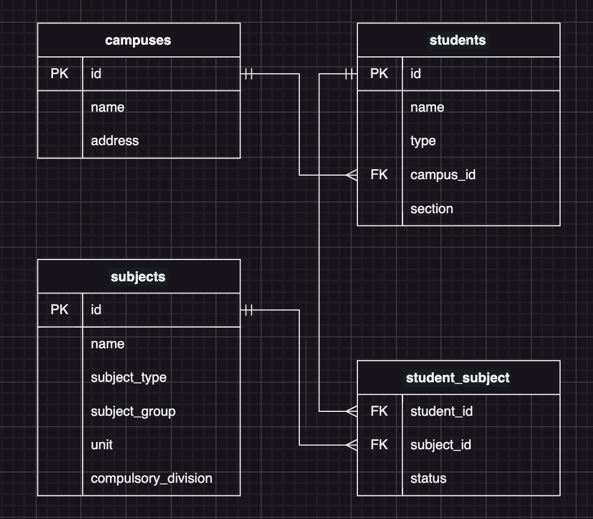

# Day3 予習アサインメント

下記の ER 図をもとにテーブルを作成してみよう

## 要件

- 下記のテーブルが作成できること
- リレーションが適切に貼られていること

  1. campuses (校舎)
  2. students (受講生)
  3. subjects (科目)
  4. student_subject (受講生・科目の中間テーブル)

## Assignments

1. campuses テーブル作成クエリを作成
2. students テーブル作成クエリを作成
3. subjects テーブル作成クエリを作成
4. student_subject テーブル作成クエリを作成
